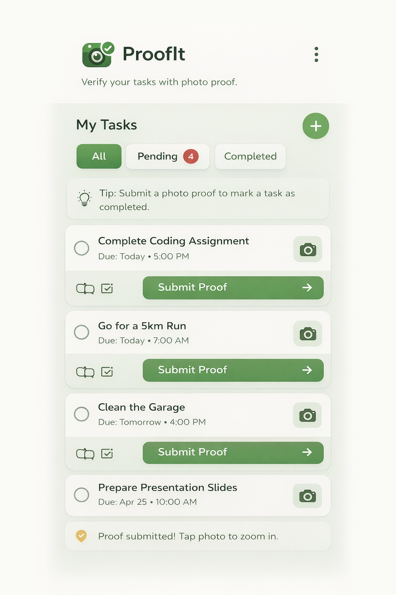

<!-- 🔥 HEADER -->

  

<h1 align="center">Hi 👋, I'm Ananthu A R</h1>

  

  🌐 <a href="https://ananthu-dev.vercel.app/">Portfolio</a>

---

## 🧠 About Me

I build **intelligent systems and real-world applications** with a focus on AI/ML and scalable solutions.  
Passionate about turning ideas into practical, impactful technology.

---

## 🚀 Featured Project

### 🧠 Crash Sense

AI-powered system that predicts and mitigates application crashes in Linux, improving system reliability through intelligent analysis.

---

## 🚀 Projects

<table>
<tr>
<td width="50%">

### 🌾 Krishi Mithra *(In Progress)*  

Direct farmer-to-consumer platform improving efficiency and eliminating intermediaries.

</td>
<td width="50%">

### 📸 ProofIt  

Task management app enforcing accountability through photo-based proof.

</td>
</tr>

<tr>
<td width="50%">

### 🤝 Care Net  

Community platform connecting people in need with helpers.

</td>
<td width="50%">

### ⚡ More Coming  

Continuously building and exploring 🚀

</td>
</tr>
</table>

---

## 🛠 Tech Stack

  Python • Dart • C • Java  
  Flutter • HTML • CSS  
  AI/ML • Data Structures • OOP  
  Firebase • Git • VS Code • Google Colab

---

## 📊 GitHub Stats

  

  

---

## 📫 Connect

  <a href="https://linkedin.com/in/ananthuar03">LinkedIn</a> •
  <a href="mailto:ananthuar03@gmail.com">Email</a>

---

  ⚡ Building intelligent and impactful solutions

